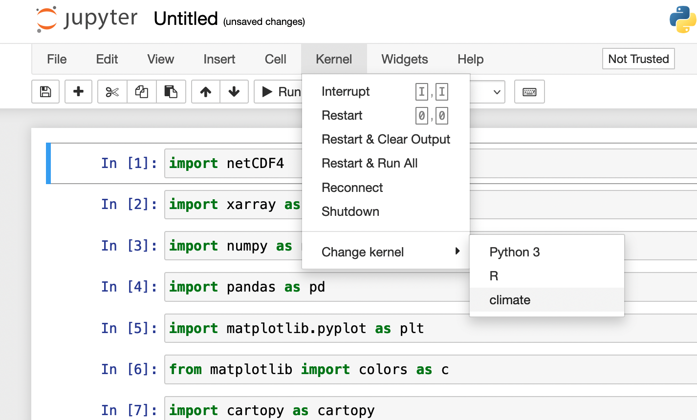

# Python

When using Python, you may find you need to use various libraries (e.g., numpy for numerical analysis or matplotlib for plotting).
Installing and managing these different libraries and their dependencies can be problematic, especially when you run into conflicts.
Conda is a package manager that helps you create and navigate "environments" to help automatically handle these conflicts.
Conda environments can help you keep the python package versions needed for your different projects separate, which helps resolve dependency conflicts.
It is good practice to *not* install packages in your base environment but instead to create separate environments.
To learn more, we recommend this [introduction to conda](https://docs.conda.io/projects/conda/en/latest/user-guide/getting-started.html) or this [conda tutorial](https://carpentries-incubator.github.io/introduction-to-conda-for-data-scientists/).

## Installing conda

For using conda on the clusters, we recommend [Miniconda](https://docs.conda.io/en/latest/miniconda.html#linux-installers).
To install Miniconda, select one of the download links on that page (for R2 and Borah choose Linux 64-bit architecture), right-click the link, and select copy link.


Then in an ssh terminal session paste that link after `wget` to download the installer script: (replace `PASTE_LINK_HERE` with the link you copied) 
```bash
wget PASTE_LINK_HERE
```

And run the installer script: (replace `USE_DOWNLOADED_FILENAME_HERE` with the name of the file you downloaded usually something starting with "Miniconda" and ending with ".sh"
```
bash USE_DOWNLOADED_FILENAME_HERE
```

For example:
```bash
wget https://repo.anaconda.com/miniconda/Miniconda3-py39_4.12.0-Linux-x86_64.sh
bash Miniconda3-py39_4.12.0-Linux-x86_64.sh
```

The following prompts will ask you if the default installation location (typically in your home directory) is alright (it is) and whether you want to initialize conda each time you log in (generally a good idea).

## Creating a conda environment

Now that you've installed conda, let's create an environment.
Optionally, you can add mamba to your base environment ([Mamba](https://mamba.readthedocs.io/en/latest/) is a package manager which often resolves conflicts more efficiently than conda.) and use mamba instead of conda.
```bash
conda install -c conda-forge -n base mamba
```

The following command tells conda to create an environment called "climate" that pulls from the conda-forge channel with the packages matplotlib and numpy: 
```bash
conda create -n climate -c conda-forge matplotlib numpy
```
or using mamba:
```bash
mamba create -n climate -c conda-forge matplotlib numpy
```

Once this environment is created, it can be activated using the following command:
```bash
conda activate climate
```

Conda/Mamba are powerful tools with many different ways they can be used, to learn more check out the [conda user guide](https://docs.conda.io/projects/conda/en/latest/user-guide/index.html).

## Creating a conda environment to work with the GPU

Many python packages distribute builds which can make use of the GPU through CUDA.
In order to build a conda environment which can use the GPU, we'll need to load these modules so that conda will detect CUDA to download the correct python package build.
Conda does this detection through [virtual packages](https://docs.conda.io/projects/conda/en/latest/user-guide/tasks/manage-virtual.html), and you can see what virtual packages conda sees by running `conda info`.

First, check out a GPU node to prevent the conda environment creation step from getting killed on the login node and load CUDA module.
You can see all the available CUDA modules by running `module av cud`.
For machine learning applications (e.g., tensorflow or pytorch) you will want to use one of the "cudnn" modules, for other applications you may only need CUDA toolkit.
```bash
gpu-session
module load cudnn8.0-cuda11.0/8.0.5.39
```

Next, create your new environment using a create command as shown above.
You can verify that the package you've installed in the environment is built with GPU support by running `conda list` with the environment active.
An appropriate build will often have "gpu" or the CUDA version in the build tag.
For example the following output is from a pytorch environment built with CUDA11.2 support: 


## Submitting jobs that use python via conda

Following is an example script to submit a python job to the scheduler. 
```bash
#!/bin/bash
#SBATCH -J python 		    # job name
#SBATCH -o log_slurm.o%j    # output and error file name (%j expands to jobID)
#SBATCH -n 1 			    # total number of tasks requested
#SBATCH -N 1 			    # number of nodes you want to run on
#SBATCH -p bsudfq			# queue (partition) for R2 use defq
#SBATCH -t 12:00:00 		# run time (hh:mm:ss) - 12.0 hours in this example.

# Activate the conda environment
# Replace environmentName with your environment name
. ~/.bashrc
conda activate environmentName

# Your code goes here
# Replace mypythonscript.py with the script you want to run
python mypythonscript.py
```

## Using a conda environment with Open OnDemand

[Open OnDemand](https://openondemand.org/) is a tool which provides users with a graphical interface to the cluster.
Currently Open OnDemand is only available for R2: [https://r2-gui.boisestate.edu](https://r2-gui.boisestate.edu)

In order to use your conda environment in a Jupyter Notebook through Open OnDemand, you'll need to install some additional packages.
*With the conda environment you want to use activated*, install `ipykernel`:
```bash
conda install ipykernel
```

Then run ipykernel to create the custom Jupyter kernel: (replace `ENVIRONMENT_NAME` with the environment name and `PYTHON ENV NAME` with the name you will select for the kernel)
```bash
python -m ipykernel install --user --name ENVIRONMENT_NAME --display-name "PYTHON ENV NAME"
```

Then navigate to the Jupyter Notebook App on [https://r2-gui.boisestate.edu](https://r2-gui.boisestate.edu):


Once your Jupyter session starts, select the kernel you just made (It will be listed under the name you put in `PYTHON ENV NAME` the example below shows a kernel named "climate"):


