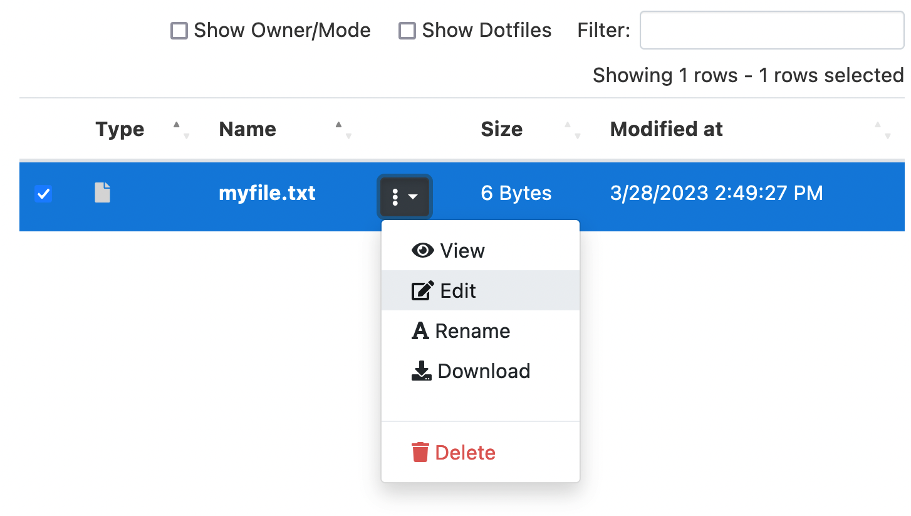
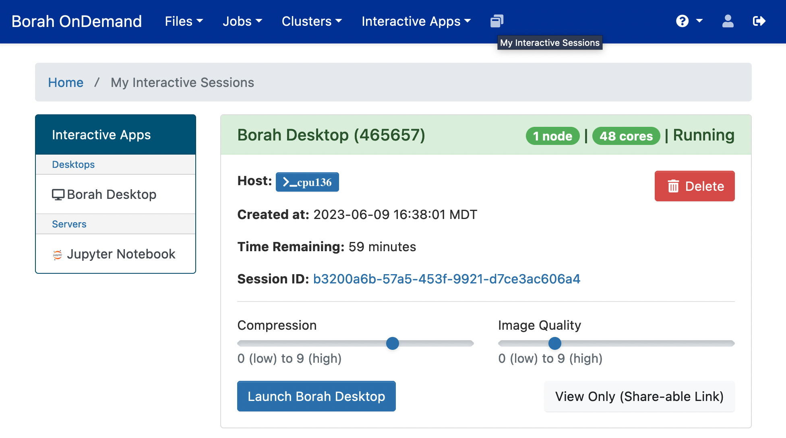

# Open OnDemand

Open OnDemand is a web portal that provides a graphical user interface (GUI) to a supercomputer cluster.
This open-source project is developed and maintained by the Ohio Supercomputer Center (OSC); you can learn more at  [https://openondemand.org/](https://openondemand.org/).
You can access the Open OnDemand portal for Borah at [https://borah-ondemand.boisestate.edu](https://borah-ondemand.boisestate.edu).
(You'll need to be on VPN and log in with your Borah username and password.)

## The Dashboard

When you first login you'll see the OnDemand Dashboard:

The services available can be accessed through the tabs at the top of the page.

## File Explorer

The file explorer tab provides a graphical explorer where you can upload, download, move, copy, delete, and create files and directories. 
There is even a graphical text editor to modify files:

## Shell Access

Through the "Clusters" tab you can access a terminal (shell) on Borah's login node:

This allows access to Borah without needing to download an ssh client or terminal emulator. 

## Interactive Apps

Perhaps the most useful service on Borah OnDemand are the interactive apps, shown here:

!!! info "Note"

    You may see additional apps if you are an authorized user of proprietary licensed software.

After selecting an interactive app, you will be taken to the "My Interactive Sessions" page.
This page will display cards for each current session with links to open the app in a new tab.
Cards for expired or failed sessions will also be shown.
You can also get to the "My Interactive Sessions" page by clicking the two pages icon to the right of the "Interactive Apps" tab on the top of the screen:

### Desktop

### Jupyter Notebook

[python conda environment](conda.md#using-a-conda-environment-with-open-ondemand)

[Julia environment](julia.md)
